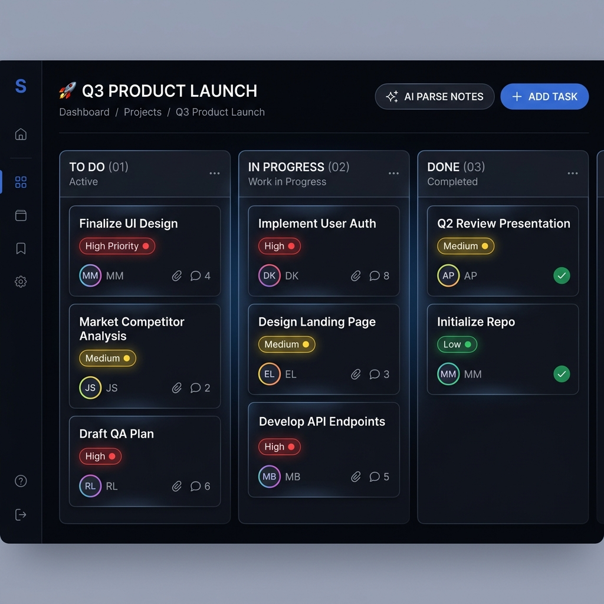
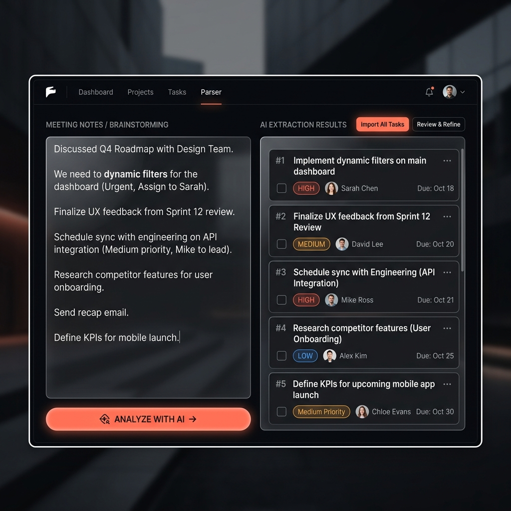
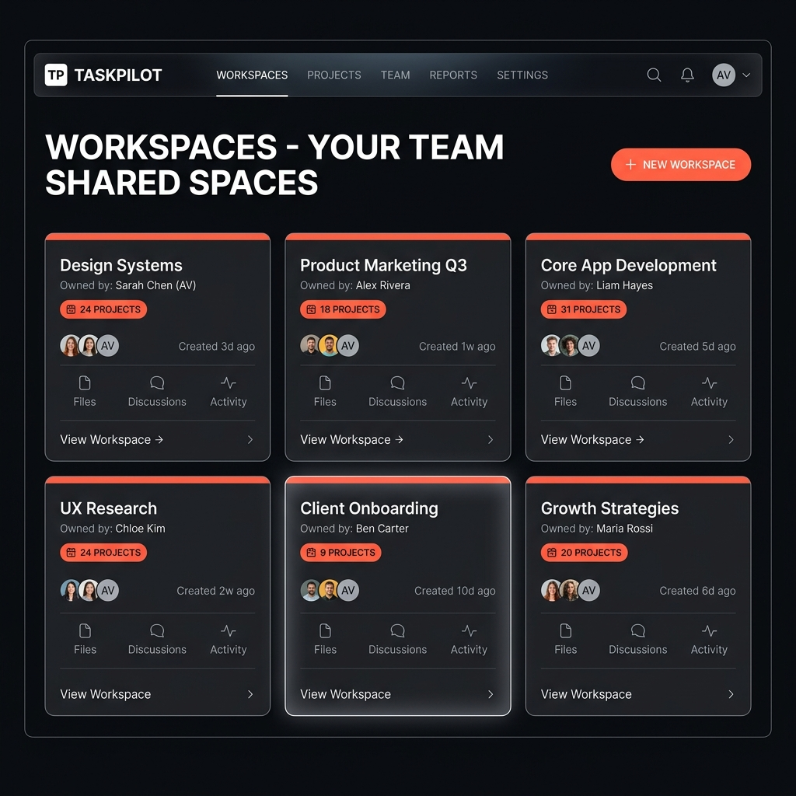
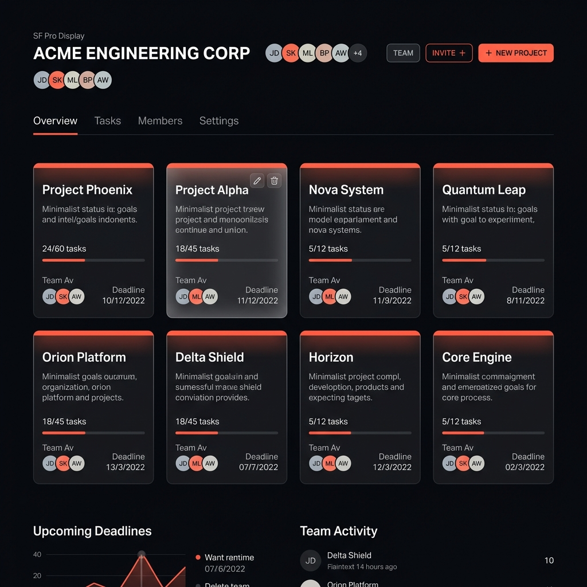

# Focusly — AI-Powered Team Project Management SaaS

[](https://laravel.com)
[](https://react.dev)
[](https://vitejs.dev)
[](https://tailwindcss.com)
[](https://reverb.laravel.com)
[](https://anthropic.com)

**Focusly** is a state-of-the-art, multi-tenant project management platform engineered for modern engineering and product teams. It combines **real-time WebSocket Kanban collaboration** with **cutting-edge AI task extraction** and **instant thread summarization**, built on a clean, decoupled architecture using **Laravel 12 (API)** and **React 19 + Vite**.

---

## 🎨 UI & Design Preview

<div align="center">
  
</div>

<br />

<table width="100%">
  <tr>
    <td width="50%" align="center">
      <b>Real-Time Kanban Board (`@dnd-kit` + Reverb)</b><br />
      
    </td>
    <td width="50%" align="center">
      <b>AI Notes-to-Tasks Parser (`claude-3-5-sonnet`)</b><br />
      
    </td>
  </tr>
  <tr>
    <td width="50%" align="center">
      <b>Workspace & Team Management</b><br />
      
    </td>
    <td width="50%" align="center">
      <b>Project Portfolios & Progress Tracking</b><br />
      
    </td>
  </tr>
</table>

---

## ✨ Key Features

### 🏢 Multi-Tenant Workspaces & Role-Based Access Control (RBAC)
- **Granular Workspace Roles**: Invite teammates via email and assign workspace-scoped roles (`owner`, `admin`, or `member`).
- **Server-Side Security Enforcement**: All mutations are protected server-side via Laravel **Policies** and specialized middleware (`EnsureWorkspaceMember`), ensuring users cannot access or modify resources across workspace boundaries.

### ⚡ Real-Time Kanban Boards via WebSockets
- **Fluid Drag-and-Drop**: Built with `@dnd-kit` for responsive, accessible card positioning across columns (`To Do`, `In Progress`, `Done`).
- **Instant Synchronization**: Every drag event, status change, and comment creation broadcasts instantaneously to all connected workspace teammates via **Laravel Reverb** and **Laravel Echo** WebSockets.

### 🤖 AI-Powered Collaboration (`claude-3-5-sonnet`)
- **AI Notes-to-Tasks Parser**: Paste unstructured meeting transcripts, product specification docs, or quick brainstorming notes. Our backend `AiTaskParser` service queries Anthropic Claude to intelligently extract structured tasks, infer priority (`low`, `medium`, `high`), assign due dates, and match assignees automatically.
- **AI Thread Summarizer**: One-click summarization of lengthy task comment threads so new team members can catch up instantly without reading dozens of back-and-forth messages.

### 💬 Deep Task Collaboration & Attachments
- **Rich Task Comments**: Real-time discussion threads attached directly to individual cards.
- **File & Image Attachments**: Secure local and cloud-compatible file storage (`attachments` table) for specs, designs, and logs.
- **Instant Notifications**: Real-time bell alerts when assigned to tasks or mentioned in discussions.

### 💎 Dark Glassmorphic Design System
- Built with custom HSL color tokens, backdrop blurs, crisp borders, and subtle micro-animations for an ultra-premium visual experience.
- Uses modern typography (`Inter`) and responsive layouts tailored for high-density workflow productivity.

---

## 🏗 System Architecture

Focusly is built using a cleanly decoupled architecture: `focusly-api` serves purely as a REST/WebSocket API, while `focusly-web` operates as an independent SPA client.

```
┌────────────────────────────────────────────────────────┐
│             React 19 SPA (Vite + Tailwind v4)          │
│                   http://localhost:5173                │
└──────────┬──────────────────────────────┬──────────────┘
           │ Axios (SPA Token / Cookies)  │ Echo WebSockets
           ▼                              ▼
┌──────────────────────────┐    ┌────────────────────────┐
│     Laravel 12 API       │    │     Laravel Reverb     │
│   http://localhost:8000  │    │   ws://localhost:8080  │
└──────────┬───────────────┘    └────────────────────────┘
           │
           ├─► MySQL 8.0 Database (focusly DB)
           └─► Anthropic Claude API (AiTaskParser / AiThreadSummarizer)
```

---

## 🗄️ Database & Relational Schema

Focusly uses Eloquent ORM with strict foreign key constraints across 8 core entities:

```
users
  ├── id, name, email, password, avatar_url, is_super_admin, last_login_at

workspaces
  ├── id, name, owner_id (FK -> users)

workspace_members
  ├── id, workspace_id (FK -> workspaces), user_id (FK -> users), role (owner|admin|member)
  └── unique(workspace_id, user_id)

projects
  ├── id, workspace_id (FK -> workspaces), name, description

tasks
  ├── id, project_id (FK -> projects), title, description, status (todo|in_progress|done)
  ├── priority (low|medium|high), assignee_id (FK -> users, nullable), due_date (nullable)
  └── created_by (FK -> users)

comments
  ├── id, task_id (FK -> tasks), user_id (FK -> users), body

attachments
  ├── id, task_id (FK -> tasks), url, filename, uploaded_by (FK -> users)

notifications
  └── id, user_id (FK -> users), type, payload (json), read (boolean)
```

### Key Relationships
- `User` hasMany `WorkspaceMember` | belongsToMany `Workspace` through `workspace_members`.
- `Workspace` hasMany `Project` | belongsTo `User` (`owner`).
- `Project` hasMany `Task`.
- `Task` belongsTo `Project` | belongsTo `User` (`assignee` & `creator`) | hasMany `Comment` | hasMany `Attachment`.

---

## 🔐 Role-Based Access Control (RBAC) Specification

| Action | `owner` | `admin` | `member` |
| :--- | :---: | :---: | :---: |
| Create / Edit / Delete Workspaces | ✅ | ❌ | ❌ |
| Invite Members & Manage Roles | ✅ | ✅ | ❌ |
| Remove Teammates from Workspace | ✅ | ✅ | ❌ |
| Create / Edit Projects | ✅ | ✅ | ❌ |
| Delete Projects | ✅ | ✅ | ❌ |
| Create / Assign / Move Tasks | ✅ | ✅ | ✅ |
| Post Comments & Upload Attachments | ✅ | ✅ | ✅ |
| Use AI Notes Parser & Summarizer | ✅ | ✅ | ✅ |

---

## 📡 API Endpoints Reference

### Auth & User (`AuthController`)
| Method | Endpoint | Description |
| :--- | :--- | :--- |
| `POST` | `/api/register` | Register new user account and issue token |
| `POST` | `/api/login` | Authenticate user credentials |
| `POST` | `/api/logout` | Revoke current Sanctum access token |
| `GET` | `/api/user` | Retrieve currently authenticated user profile |

### Workspaces & Members (`WorkspaceController`)
| Method | Endpoint | Description |
| :--- | :--- | :--- |
| `GET` | `/api/workspaces` | List all workspaces where user is a member |
| `POST` | `/api/workspaces` | Create new workspace (assigns creator as `owner`) |
| `GET` | `/api/workspaces/{id}` | Get workspace details, members, and projects |
| `POST` | `/api/workspaces/{id}/invite` | Invite user by email with specific role |
| `DELETE` | `/api/workspaces/{id}/members/{user_id}` | Remove member from workspace |

### Projects & Tasks (`ProjectController` & `TaskController`)
| Method | Endpoint | Description |
| :--- | :--- | :--- |
| `GET` | `/api/workspaces/{id}/projects` | List all projects within a workspace |
| `POST` | `/api/workspaces/{id}/projects` | Create project inside workspace |
| `GET` | `/api/projects/{id}/tasks` | Retrieve all tasks, comments, and attachments |
| `POST` | `/api/projects/{id}/tasks` | Create new task card |
| `PUT` | `/api/tasks/{id}` | Update task details, status, priority, or assignee |
| `DELETE` | `/api/tasks/{id}` | Delete task |

### AI Assistant (`AiController`)
| Method | Endpoint | Description |
| :--- | :--- | :--- |
| `POST` | `/api/ai/parse-notes` | Parse raw text notes via Claude into task JSON objects |
| `POST` | `/api/ai/summarize-thread` | Generate concise summary of task comment history |

---

## 🚀 Quick Start Guide

### Prerequisites
- **PHP 8.2+** & **Composer 2.x**
- **Node.js 20+** & **npm 10+**
- **MySQL 8.0+** (or XAMPP / MariaDB equivalent)

### 1. Database Setup
Log into MySQL and create the `focusly` database:
```sql
CREATE DATABASE focusly CHARACTER SET utf8mb4 COLLATE utf8mb4_unicode_ci;
```

### 2. Backend API Setup (`focusly-api`)
Navigate to the backend directory, install PHP dependencies, and configure your environment:
```bash
cd focusly-api
composer install
cp .env.example .env
php artisan key:generate
```

Update `.env` in `focusly-api` with your database credentials and Anthropic Claude API key:
```ini
APP_NAME=Focusly
APP_ENV=local
APP_URL=http://localhost:8000
FRONTEND_URL=http://localhost:5173

DB_CONNECTION=mysql
DB_HOST=127.0.0.1
DB_PORT=3306
DB_DATABASE=focusly
DB_USERNAME=root
DB_PASSWORD=

# WebSockets (Laravel Reverb)
BROADCAST_CONNECTION=reverb
REVERB_APP_ID=focusly
REVERB_APP_KEY=focusly-key
REVERB_APP_SECRET=focusly-secret
REVERB_HOST="localhost"
REVERB_PORT=8080
REVERB_SCHEME=http

# AI Service Key
ANTHROPIC_API_KEY=your_claude_api_key_here
```

Run database migrations and seed default sample data (users, workspaces, sample projects, and tasks):
```bash
php artisan migrate --seed
```

Start the API development server and the Laravel Reverb WebSocket server in separate terminal windows:
```bash
# Terminal 1: Serve Laravel API on http://localhost:8000
php artisan serve --host=127.0.0.1 --port=8000

# Terminal 2: Start Laravel Reverb WebSocket Broker on port 8080
php artisan reverb:start --debug
```

### 3. Frontend Client Setup (`focusly-web`)
Navigate to the frontend directory, install JavaScript dependencies, and start Vite:
```bash
cd focusly-web
npm install
npm run dev
```

Visit **http://localhost:5173** to access the Focusly workspace application.

---

## 🧪 Testing Suite

Focusly includes thorough automated testing across both frontend and backend domains:

### Backend Feature & Unit Tests (PHPUnit / Pest)
Covers authentication, RBAC authorization policies, task mutations, and database invariants:
```bash
cd focusly-api
php artisan test
```

### Frontend Component Tests (Vitest)
Validates React hooks (`useAuth`, `useNotifications`), utility helpers, and component behavior in `jsdom`:
```bash
cd focusly-web
npm test
```

---

## ☁️ Production Deployment Guide

### Backend — Railway or Render Deployment
1. Create a new PHP service on [Railway.app](https://railway.app) pointing to the `focusly-api` folder.
2. Attach a **MySQL** database instance and link the `DATABASE_URL`.
3. Set your production `.env` variables (`APP_ENV=production`, `FRONTEND_URL`, `SANCTUM_STATEFUL_DOMAINS`, `ANTHROPIC_API_KEY`).
4. Run migrations during build: `php artisan migrate --force`.
5. Provision a background worker service running `php artisan reverb:start --host=0.0.0.0 --port=8080` for secure WebSocket broadcasting (`wss://`).

### Frontend — Vercel or Netlify Deployment
1. Import the `focusly-web` folder into [Vercel](https://vercel.com).
2. Set Build Command: `npm run build` and Output Directory: `dist`.
3. Configure the Production Environment Variables:
   ```ini
   VITE_API_URL=https://your-api-domain.railway.app/api
   VITE_REVERB_APP_KEY=focusly-key
   VITE_REVERB_HOST=your-api-domain.railway.app
   VITE_REVERB_PORT=443
   VITE_REVERB_SCHEME=https
   ```

---

## 📄 License & Credits

Focusly is open-source software built by [Zakaria Bouallali](https://github.com/zakaria-bouallali). Licensed under the **MIT License**.
